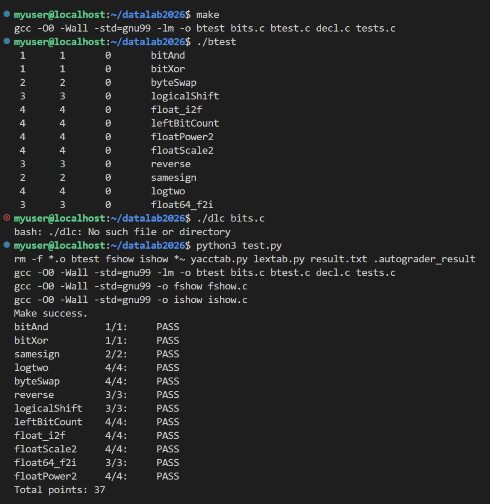

# DataLab 实验报告
姓名：汪相君
学号：2023200088

| 总分 | bitAnd | bitXor | samesign | logtwo | byteSwap | reverse |
| ---- | ------ | ------ | -------- | ------ | -------- | ------- |
| 37   | 1      | 1      | 2        | 4      | 4        | 3       |

| logicalShift | leftBitCount | float_i2f | floatScale2 | float64_f2i | floatPower2 |
| ------------ | ------------ | --------- | ---------- | ----------- | ----------- |
| 3            | 4            | 4         | 4          | 3           | 4           |


测试截图：


## 解题报告
### 整体思路
这次实验的题目可以清晰分成两条主线：整数位运算和浮点数位操作。整数题的核心是补码规则、算术右移特性、掩码构造和二分查找思想，很多题目不是硬算结果，而是把问题转化成“某一位是否为1”“某一段是否全0/全1”的判断。浮点题则完全围绕IEEE 754的位布局展开，单精度是1位符号+8位指数+23位尾数，双精度是1位符号+11位指数+52位尾数，所有运算都只能拆位、移位、判断边界再重新拼接，不能用真实的浮点运算。

我做题的习惯是先归类：这道题属于逻辑等价变换、掩码操作、二分找位还是浮点分段，先写出能过普通用例的版本，再用`./btest -f 函数名`单独测边界。浮点题的边界尤其多，0、最大非规格化数、最小规格化数、Inf、NaN、溢出这些点都要逐个过一遍。

### 个人实现亮点
1. **byteSwap**：采用“取出字节→清零原位置→交换回填”的三步写法，逻辑直观，不容易在移位和掩码上出错。
2. **reverse**：没有用复杂的分治位反转技巧，用循环逐位移位的朴素实现，代码短可读性强，也符合初学者的思路。
3. **float_i2f**：完整实现了guard-round-sticky就近舍入逻辑，处理好了“正好一半舍入到偶数”和尾数进位溢出的边界情况。

### 整数位运算部分
整数题大致可以分成三类：**逻辑等价变换类**、**掩码移位类**、**二分找位类**。

#### 逻辑等价变换类
这是最基础的位运算题，核心就是用布尔代数的德摩根定律，把禁止的运算符转换成允许的运算符。
`bitAnd`只用`~`和`|`实现按位与，本质就是德摩根定律的直接应用：
```c
// x & y = ~(~x | ~y)
return ~(~x | ~y);
```
`bitXor`只用`~`和`&`实现异或，思路是排除掉“两位都为1”和“两位都为0”两种相同情况，剩下的就是不同的位，核心表达式是：
```c
// 排除都为1 和 都为0 的情况，剩下的就是异或
return ~(~x & ~y) & ~(x & y);
```
这两道题思路直接，操作符数量也远低于题目上限。

#### 掩码移位类
这是位运算最常用的技巧，通过构造掩码提取、清除、修改指定的位段。
`samesign`判断两个数是否同号，最容易踩的坑是0的特殊规则：0既不算正数也不算负数，只有两个0才算同号。我先用算术右移拿到符号位，再分情况判断，核心是利用`x >> 31`的符号扩展特性：
```c
int sx = x >> 31;  // 负数全1，正数/0全0
int sy = y >> 31;
```
先判断两个都是负数直接返回1，符号位不同直接返回0，剩下都非负的情况再区分0和正数。

`logicalShift`实现逻辑右移，C语言默认的`>>`对有符号数是算术右移，高位会补符号位1，逻辑右移要求高位补0。我的做法是先做算术右移，再构造掩码清掉高位多余的1，核心掩码构造：
```c
// 高n位为0，低位全1的掩码
int mask = ~((1 << 31) >> n << 1);
return (x >> n) & mask;
```

`byteSwap`是我写得最顺的一道题，采用“取出→清零→回填”三步法，逻辑非常直观：
```c
// 取出两个字节
int byte_n = (x >> shift_n) & 0xFF;
// 清零原位置
int x_cleared = x & ~mask;
// 交换回填
return x_cleared | (byte_n << shift_m) | (byte_m << shift_n);
```
先把字节序号乘8转成比特偏移，分别取出两个字节，再用掩码把原位置的字节清零，最后交换位置回填，每一步动作都很明确，几乎没怎么调试就通过了。

#### 二分找位类
核心是用逐段二分的方式代替循环，控制操作符数量，也是技巧性最强的一类题。
`logtwo`求以2为底的对数，本质是找最高位1的位置，答案范围0到31正好是5位二进制，用二分思想逐段确定：
```c
int b16 = v > 0xFFFF;  // 高16位有没有1
v >>= (b16 << 4);     // 有就右移16位，继续看低位
```
先判断高16位，再依次判断8位、4位、2位、1位，每段的贡献直接用移位累加。比较表达式的结果本身就是0或1，可以直接当移位量用，这是我觉得最巧妙的地方。

`leftBitCount`统计从最高位开始连续1的个数，我先把x取反，问题就转化成了求前导零的个数，思路和logtwo完全一致，也是二分逐段判断，最后补上全1的边界情况。

`reverse`位反转我没有用复杂的分治技巧，用了最朴素的循环逐位写法，反而更符合初学者的思路：
```c
// 每次取v的最低位，放到r的最低位
r = (r << 1) | (v & 1);
v >>= 1;
```
循环32次就完成了整体反转，循环条件写成`for(i=32; i; i=i-1)`，也避开了题目不允许的比较运算符。

### 浮点数部分
浮点题整体比整数题难很多，核心都是围绕IEEE 754的位布局，拆成符号、指数、尾数三部分处理。我把它们分成两类：**指数操作类**和**格式转换类**。

#### 指数操作类
相对简单，主要围绕指数的增减和边界判断。
`floatPower2`求2的x次方，尾数永远是0，只需要处理指数，分四段判断边界就行，核心就是设置指数字段：
```c
// 规格化区间，直接设置指数
if (x >= -126) return (x + 127) << 23;
```
只要记准-126、-149、128三个分界点，分别对应规格化下界、非规格化下界和溢出边界，就不容易错。

`floatScale2`实现浮点数乘2，规格化数很简单，指数加1就行：
```c
// 规格化数乘2 = 指数+1
exp = exp + 0x00800000;
```
麻烦的是非规格化数，指数为0的时候乘2只能尾数左移一位，如果左移后第23位变成1，说明刚好升级成最小的规格化数，要特殊处理；NaN和无穷的情况直接原样返回。

#### 格式转换类
是浮点题的难点，涉及整数和浮点数的互转，要处理规格化、舍入、溢出等很多边界。
`float64_f2i`把双精度浮点数转成整数，双精度分成两个32位传入，先要拼接有效数字：
```c
// 拼接隐藏位1 + 高20位尾数 + 低32位尾数的高位
unsigned val = 0x80000000u | ((uf2 & 0xFFFFF) << 11) | (uf1 >> 21);
```
然后判断指数范围，小于1023返回0，大于1054返回溢出值，中间的按指数移位把小数点移到整数位置，最后处理符号和溢出。这道题最容易搞混单双精度的偏移量，单精度127、双精度1023，写的时候要反复确认。

`float_i2f`是我花时间最久的一道题，也是我觉得实现得最扎实的亮点题。把int转成单精度浮点数，最复杂的是舍入部分，要符合IEEE就近舍入到偶数的规则，我用guard-round-sticky三位判断：
```c
// guard是最高丢弃位，round第二位，sticky低位是否有1
int inc = guard & (round | sticky | (frac & 1));
frac += inc;
```
只有guard为1，并且round、sticky或者尾数最低位有一个为1的时候才进位，保证正好一半的时候舍入到偶数。舍入之后还要检查尾数有没有溢出，如果进位到第23位，就要尾数清零、指数加1。还有x=0的情况必须单独判断，不然规格化的循环会死循环。

## 反馈与收获
这次实验前前后后花了两天多，作为初学者一开始真的很懵，补码、位运算、浮点数格式都只停留在课本概念上，真的动手写才发现到处都是坑。

整数题还好，对着二进制数一点点推总能调对；浮点题真的难，舍入规则、规格化非规格化的区别、溢出下溢的边界，每一个点都能卡很久。我反复翻了CSAPP的第二章，又对着测试用例一个一个拆位看，才慢慢理清楚。调试的时候也踩了不少低级坑，比如改完代码忘记重新make，跑半天还是旧结果；比如把算术右移和逻辑右移搞混，查bug查到怀疑人生。

全部通过的时候还是很有成就感的，最大的收获就是真正理解了“数据在内存里都是二进制”这句话，int和float本质上没有区别，只是解释方式不同。位运算看起来很底层，但用好了真的很巧妙，也让我对计算机怎么处理数据有了更具象的认识。

## 参考资料
- 《深入理解计算机系统（CSAPP）》第二章、第三章，位运算与IEEE 754浮点数相关章节
- CSAPP-DataLab 习题参考，知乎：[https://zhuanlan.zhihu.com/p/59534845](https://zhuanlan.zhihu.com/p/59534845)